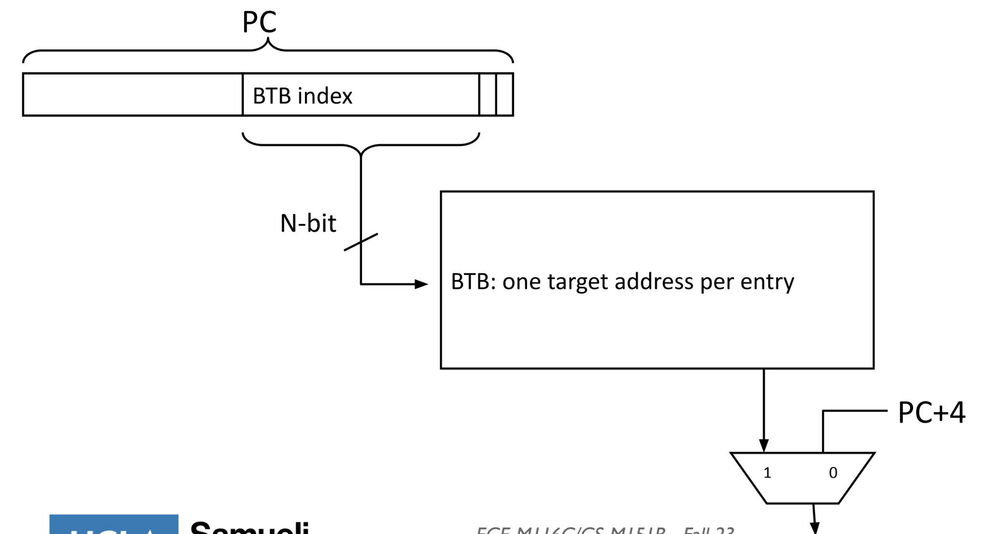
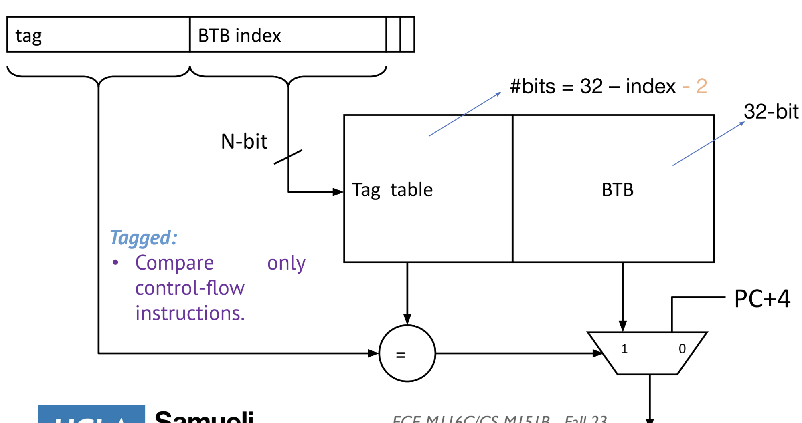
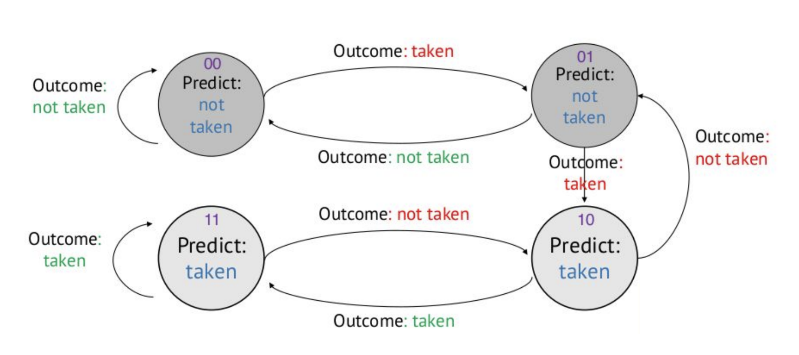
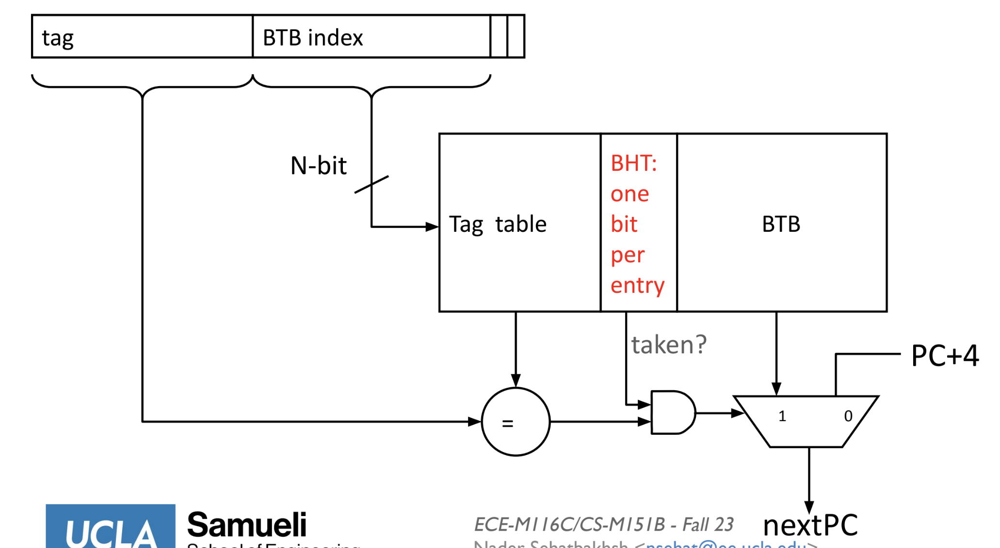

# Branch Prediction and Superscalar
## Branch Prediction
- Prediction accuracy can be improved by always predicting *taken* - doing this, however, requires needing to know the next PC during the *fetch* stage
  - The approach for doing this involves *keeping track* of previous branch instructions and their target addresses, and then using this buffer to know exactly where to branch when the *same* instruction is encountered again
- The **Branch Target Buffer (BTB)** is a table that stores *target addresses*, with its entries *indexed by PC*
  - Visualize it as an array with each row storing a target address, with the *program counter* acting as an index
    - The number of bits to represent the PC is small, so this approach works
  - Algorithm:
    - For a new PC, record the target address in the table (using the PC as the index)
    - On a recurring PC, look up the target address by index and use that for prediction
  - 
- Once an instruction as *decoded*, it is known that is a control-flow instruction and the target address is also known (because branches are resolved at decode), so the the Branch Target Buffer is updated during the decode stage
  - This guarantees that entries in the Branch Target Buffer are control flow instructions - it will always miss on non-control-flow instructions
- Using a branch target buffer, instructions that have been *seen before* can be simply taken whereas instructions that have *not been seen before* still incur a one-cycle stall for correctness
- Using a branch target buffer is justified by the **temporal** and **spacial localities** of programs
  - Programs are typically very predictable - *90% of time is spent in only 10% of code*, often as a result of loops 
### Branch Target Buffer Design
- 
  - Ideally, the number of lines in the BTB should be the size of the PC, but this is not feasible ($2^{32} \times 4 bytes$, as there are 32 bits for the PC each corresponding to a row and each row has 4 bytes since addresses are 32 bits)
    - Thus, the entire PC is not the index, but instead a *subset* of the PC (N bits)
    - The first two bits do not need to be read, because the PC is incremented by fours (it will never be incremented by one or two, so there is no need to store the first two bits), so the subset will be from bit 2 to N + 2
    - Since the PC is not fully used as an index, an additional **tag table** is necessary to ensure there are not collisions (because some of the bits are cut off, it may be the case that two different PCs that appear the same after the truncation)
      - This tag table can store the *the truncated bits of the PC* as the tag, and then this tag in the table can be compared to the corresponding bits of current PC being checked against the table 
      - The tag table is stored in the Branch Target Buffer; one column is the tag, and the other is target address
      - As a result of the potential collision/aliasing issue, it is the case that only *one branch* instruction with the N bits can be stored in the branch target buffer
      - 
        - The table is indexed by the N bits of the PC, but the tag itself is the remaining 32 - index - 2 bits
        - The resulting size is $2^{N} \times (32 - N - 2 + 32)$
  - The outcome of the BTB is fed into a MUX - if there is a hit, then it will be selected; otherwise, PC + 4 will be selected
### Types of Control Flow Instructions
- **Conditional**: Whether the branch is taken is unknown at fetch time, there are 2 possible fetch addresses (PC + 4 or PC + immediate), and the branch is resolved at decode (rs1 == rs2)
  - i.e. `BEQ`
  - Branch Target Buffers *sometimes* help for these control flow instructions, depending on whether the condition is met or not
- **Unconditional** and **Call**: The branch is always taken, and there is only one possible next fetch address (PC + offset) that is determined at the decode stage
  - i.e. `JAL` `CALL`
  - Branch Target Buffers *always* help for these types of control flow instructions
- **Return** and **Indirect**: The branch is always taken, but there are many possible next fetch addresses, as they are register dependent - so this is resolved during the decode stage
  - i.e. `JALR` and `RET`
  - Branch Target Buffers *never* help for these types of control flow instructions 
### Dynamic Branch Predictor
- Instead of only committing to *not taken* or *taken*, a **branch predictor** predicts branch outcomes *dynamically* by keeping track of *history*
  - If it is observed in the past that a branch is frequently taken, then it is likely that it will again be taken, and the same applies for not taken
- A **branch history table** is added to the branch target buffer
  - Whenever the branch target buffer is updated during the decode phase, an additional bit(s) can be added to the table indicating the last behavior of the branch (not taken or taken)
    - One bit results in the predictions being prone to outliers (i.e. Pattern of `TTTTTNTTTT` results in a prediction of `TTTTT TN TTT`, where the prediction first incorrectly predicts taken, and then subsequently incorrectly predicts not taken because of the bit switch)
      - In the worst case scenario, this can result in zero percent accuracy for a frequently switching branch
    - Two bits suffices better to potential outliers, though this requires a more complex finite-state machine to remember the last two outcomes instead of the last outcome
      -  
  - 
- A branch history table and branch target buffer is helpful for conditional branches, but it still does not address the issue for `JALR` instructions since there are too many potential addresses - these instructions are instead better predicted using indirect predictors
  - `RET` is predicted using the stack, which should be stored on the register corresponding to the stack pointer