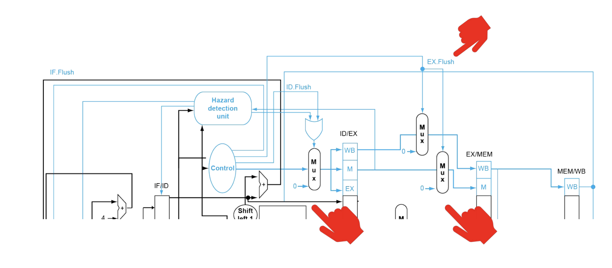
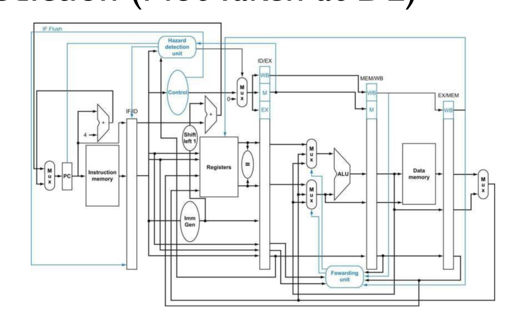

# Control Hazards and Speculation
- There are other types of hazards
  - In a **structural hazard**, one unit is busy - this occurs in designs that utilize shared resources (not necssarily a single-cycle or pipelined design, however)
  - There is also a **control hazard** associated with branches
- In a pipelined design, it takes some time to resolve a branch
## Understanding Branches
- It is understood *when* there is an actual branch after an instruction is decoded, as the `Control` unit can parse the opcode and readily determine if the instruction is a branch
  - This is the end of `ID` stage (so beginning of `EX` stage)
- It is understood *where* to branch during the `ID/EX` stage
  - This is the end of `EX` stage or beginning of `MEM` stage
- It is understood *whether* the branch will actually be taken after the `EX` stage, so during the `EX/MEM` stage
  - This is during the end of the `MEM` stage, so the beginning of `Writeback` stage
- 
  - Here, it takes *3 cycles* to understand the outcome of a branch - this is too long to *stall* because most programs utilize a lot of branching instructions (`if/else`, `for/while`)
## Speculation
- One approach to dealing with control hazards is to **speculate** - predict an outcome (branch taken versus not taken) and then fetch the instruction based on this prediction
  - If it is predicted that the branch is *not taken*, then there is no need to stall at all
    - Speculating always that a branch is *not taken* is not a bad approach, as it is fine about *86%* of the time considering all instructions (including branching *and* non-branching instructions)
## Flushing
- If it is predicted that a branch is taken but in actuality it *is taken*, then it is necessary to **flush** the wrong instructions (from the assumed not-taken branch)
  - 
    - When whether the branch will be taken is determined at the end of the `MEM` stage, the previous stages are replaced with `NOOP`s (except for the fetch stage, which will fetch the correct branch instruction)
    - These bubbles are inserted using the same trick as with load hazards - sending zero control signals via `MUX`es so that state is not changed
      - Except now, the `Fetch`, `Decode`, and `Execute` instructions need to be flushed (because the branch is resolved at `Memory`, so by this time it knows everything beforehand is wrong)
- In the case of a branch miss, there is a penalty of *three instructions* being flushed, which is effectively the same as stalling for three cycles
  - This warrants need for impriovement, since most branches themselves (considering *only* branch instructions) are taken
## Branch Control Improvements
- The miss penalty can be reduced via a number of ways
  - Determining *where* the branch will go to can be determined during the `Decode` stage, since the offset is already available during this stage - so the calculating of `nextPC` can be performed during this stage as long as there is an `adder` unit available in the stage
  - Determining *whether* the branch will be taken can be determined also during the `Decode` stage, as both `rs1` and `rs2` are available, so if they are compared after they are read from the reigster file, detection can be done much quicker
## New Design for Branch Detection
- 
  - If the branch is determined be to true, then the `Zero` signal will indicate that there is a branch and relay the proper flush signals (to the previous `IF` stage)
    - This signal to `IF` prevents an incorrect instruction from proceeding to the next stage - it essentially stalls the `Fetch` stage
  - The `ALU` no longer needs a zero flag to detect a branch
- With this new design, only *one instruction* needs to be flushed
  - This requires, though, that, forwarding occurs one cycle to the left 
- The compiler makes branching simpler by performing a reordering of the instruction - i.e. a **delay slot** that moves an *independent* instruction between the branch and the next instruction, so that there is no need to stall
  - The compiler also may change the branch conditionals to increase the chance of not-taken
  - The compiler may also perform loop unrolling