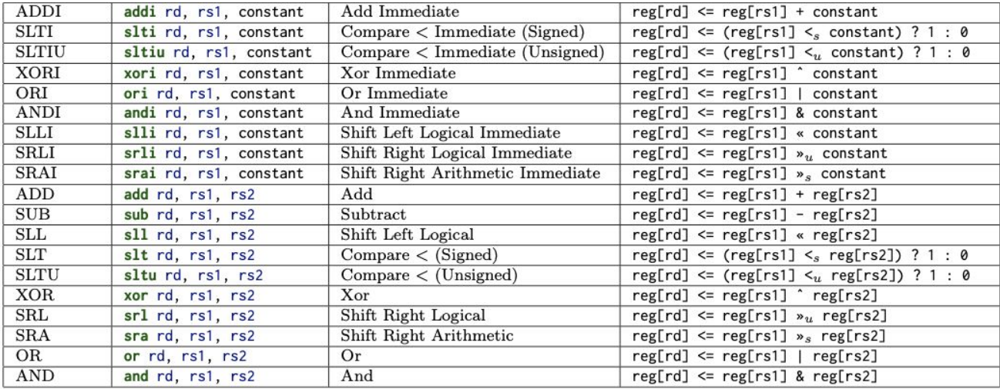
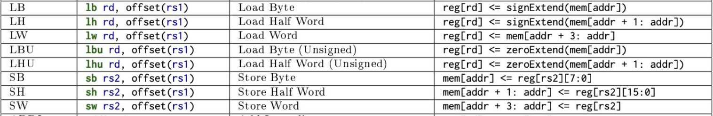
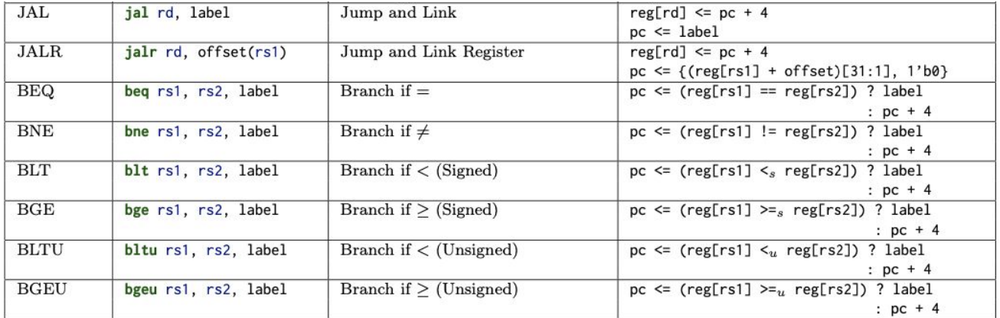
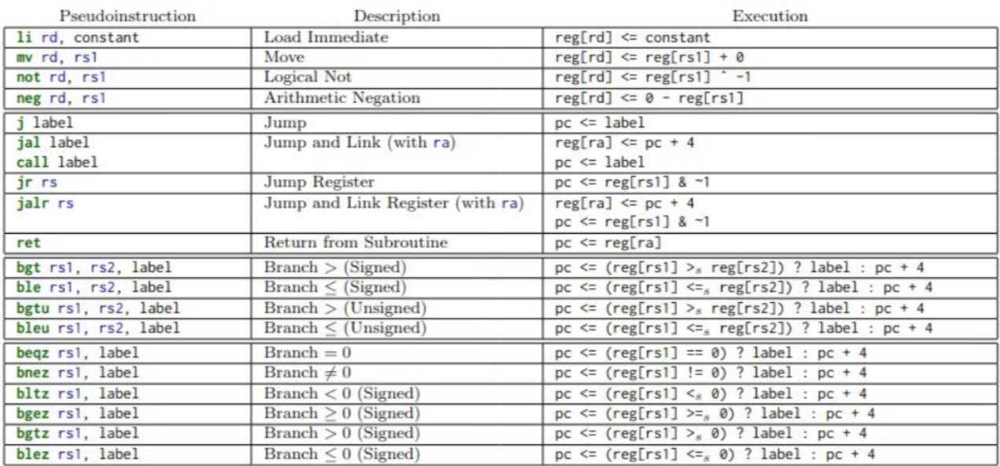
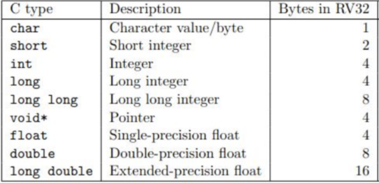

# Instruction Set Architecture (ISA)
- The **instruction set architecture** acts as a *contract* between software and hardware, providing all programmer-visible state, such as registers and memory as well as the hardware-specific instructions that operate on such state
  - There are many implementations possible for a given ISA, such as AMD64 or ARM, etc.
## RISC-V
- **RISC-V** is an open-source ISA
  - It stands for **Reduced Instruction Set Computers** (the alternative is **Complex Instruction Set Computers (CISC)**)
  - RISC ISA's have fixed-size instructions (unlike CISC architectures where instructions may vary in size - may require padding)
  - RISC ISA's typically have simple (one-by-one) operations whereas CISC ISA's typically have complex operations (many instructions packed in one - think of `leaq`)
## Stored Program Computer (von Neumann Computer)
- Computer hardware can be thought of as a *machine* that reads instructions one-by-one and executes them *sequentially*, doing so until the program finishes
  - Execute instruction -> Load next instruction -> Repeat
- The memory component of computer hardware holds both programs (instructions) *and* data
  - From the point of memory, there is no real difference between the two (both are stored in a linear memory array)
- Instruction Processing:
  - The Program Counter (PC) identifies current instructions
    - It points to the memory address of the current instruction 
    - If the program has just loaded, it points to the memory address of the first instruction of the program
  - This current instruction is fetched from memory
  - The state of the Program Counter and memory is updated as a function of current state according to the instruction
  - This process is repeated
## Building an ISA
- The focus of an ISA is to translate a high-level programming language (i.e. C) into assembly
### Instructions
- Each instruction has a *command* (i.e. addition, load, store, etc.) portion and an *operands* (address to operate from, address to operate to) portion
  - In 32-bit RISC-V, each instruction is fixed-size and is 32-bit (so the command + operands combination is 32 bits)
- Operands:
  - **Registers**: Small storage unit inside the processor to quickly access data (think of memory hierarchy, where registers are faster in terms of access than memory)
    - Although registers are faster than memory, they are smaller and therefore cannot hold as much data as memory
    - Software is able to see (most) registers and memory
    - Modern ISA's tend to have around 16-64 registers 
    - Larger width registers (i.e. 32-bit vs 64-bit) allow for easier data transfer but are more power consuming
      - They also tend to require more physical area (which may not feasible for certain devices - i.e. mobile phones)
    - 32-bit RISC-V ISA's have 32 registers, each of which are 32-bit each (a **word**)
      - Each register is shown as *xi* (i.e. *x0, x1, x2 ... x31*)
        - *x0* is hardwired to zero (it cannot be changed) - this is useful in the many cases where something needs to be zeroed
        - Registers are stored in a data structure known as a **register file**, which can be thought of as an array of *xi*'s (each of which, as mentioned earlier, is 32 bits) 
        - All 32 registers store values in *integer* form
  - **Immediates**: Immediates are *constant numbers* to be used in an instruction
    - Example: `addi x2, x1, 5`
      - Performs x2 = x1 + 5
      - The immediate here is `5`
    - Although registers are 32-bits, immediates are typically not - they are usually less
      - This is because, in the case of immediates, they are stored *directly in the instruction*, and since the instruction must be 32-bits, they cannot exceed the word size
      - Since immediates are not typically 32 bits, **sign extension** is often required during the actual operation process in order to match the word size with the immediate and any 32-bit registers being considered
        - Since many operations are signed, proper sign-extension is necessary (padding the most significant bit with zeroes vs. padding with ones; padding the least significant bit with just zeroes is sufficient)
  - **Memory**: Values stored in a memory cell can be accessed during operations - memory should be byte-addressable (8 bit rows) in order to ensure compatibility
    - The **load** operation loads a value *from* memory (reads an address from memory and loads it into a register or some other memory location)
    - The **store** operation writes a value *to* memory (reads some value and writes it to the specified memory address)
    - Memory is typically addressed in **base and offset** form - that is, it is specified as *xi + offset*
      - Memory addresses are not *directly* specified because, as mentioned earlier, they are too large to be specified directly via immediates
      - Instead, a register stores a base memory location and a smaller-valued offset is specified as an immediate
        - i.e. `addr = x2 + 300`
    - Since memory is byte-addressable, each row of memory contains 1 byte (8 bits)
      - Since ISA's may have different word sizes (i.e. 32-bit RISC-V), multiple rows of memory are read at a time (so 4 rows at a time for 32-bit RISC-V)
        - If less than 4 bytes are needed, then only those needed bytes can be read or written to and the other bytes can be ignored (writing is still done 32-bits at a time, but the unneeded bits can just be zeroed out)
      - This presents a question of *endianness* for data
        - **Little Endian**: The lower addresses of memory contain the least significant bits and the higher addresses of memory contain the most significant bits
          - `Example: 0A0B0C0D`
            - `Addr a: 0D`
            - `Addr a + 1: 0C`
            - `Addr a + 2: 0B`
            - `Addr a + 3: 0A`
        - **Big Endian**: The lower addresses of memory contain the most significant bits and the higher addresses of memory contain the least significant bits
          - `Example: 0A0B0C0D`
            - `Addr a: 0A`
            - `Addr a + 1: 0B`
            - `Addr a + 2: 0C`
            - `Addr a + 3: 0D`
      - This also may yield *alignment* issues
        - If data spans across 4-byte chunks, then multiple reads/writes to memory must be performed (i.e. reading bytes 3, 4, 5, 6 requires one read to 0-3 to get 3 and another read to get 4-6)
    - Load and Store Variants:
      - **LW**: Load word (32 bits)
      - **LB**: Load byte (8 bits)
        - Sign extends by default since loading is done into registers (which are 32-bit)
      - **LH**: Load half-word (16 bits)
        - This loads the *lower half* of the data
        - Sign extends by default
      - **LBU**: Load byte unsigned
        - Does not sign extend (just pads with zeroes)
      - **LHU**: Load half word unsigned
        - This loads the *lower half* of the data
        - Does not sign extends
      - **SW**: Store word (32 bits)
      - **SB**: Store byte
      - **SH**: Store half word
      - There is no need to worry about sign extension or padding on storage operations since data is not being 
- Instructions: 
  - **Arithmetic/ALU**
    - These operations perform an arithmetic operation on two registers or one register and an immediate and save the result in another register (destination)
      - It is convention that the leftmost register in an instruction is the destination register
    - Example: `SUB x3, x2, x1`
      - x3 = x2 - x1
    - Example: `ADDi x5, x1, -10`
      - x5 = x1 - 10
    - 
      - A **logical shift right** will sign extend with zero padding
      - A **arithmetic shift right** will sign extend appropriately
      - A **logical shift left** will always pad with zeroes
  - **Memory**
    - 
      - Note the syntax for storing
  - **Control Flow**
    - The CPU has a special register known as the **program counter (PC)** which points to a particular address in memory, fetches the instruction from that address, and then updates its state after that instruction is executed (to get the next instruction)
      - Typically, the program counter is incremented after each instruction is executed, since it is assumed that instructions are sequential - however, in the case of branches (if/elses, loops, etc.), then the program counter may need to modified in another way aside from incrementing 
    - **Jump instructions** are *unconditional* jumps
      - They require a destination address, specifying which program instruction to jump
      - These jumps are addressed relative to the program counter - so the exact instruction address is not specified but rather the offset relative to the program counter
    - **Branch instructions** are conditional - meaning they *may* change the program counter only if the condition is true
    - The process of **jumping and linking** involves storing the state of the program counter before jumping, as in the case where the original next instruction must be returned to (i.e. function calls)
      -     x1 <- pc + 4 // this is the next instruction, since each instruction is 4 bytes
            call foo
              foo 
              pc <- x1
            next instruction
    - 
      - In these instructions, the label is the absolute address of the instruction, but it is calculated as `pc + immediate`
      - In `JALR`, the address is shifted to the left by one bit and has a 0 appended to the end (LSB) - this is done to avoid jumping to odd addresses, which is not allowed by RISC-V
  - **Pseudo instructions** are not directly in the ISA, but are easily understood by compilers/assemblers - pseudo instructions are meant for convenience
    - 
  - The **RET** and **CALL** instructions follow RISC-V's **calling convention**
    - The **callee** promises to leave some registers unchanged for the caller - it *can* modify these registers in the procedure, but if it does so it must save these registers on the stack first so that it can be recovered later
      - The return address is also saved on the stack and recovered at the end (this supports nested procedure calls) 
    - The **caller** puts arguments on the stack and invokes the callee by using the call instruction
  - Assembly code is converted to **machine code**, which is readable by hardware, typically through the use of a table 
- 
