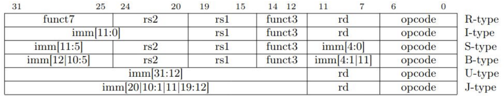
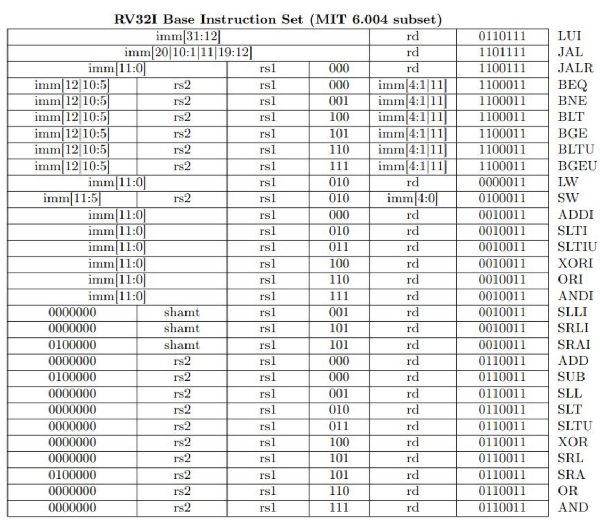
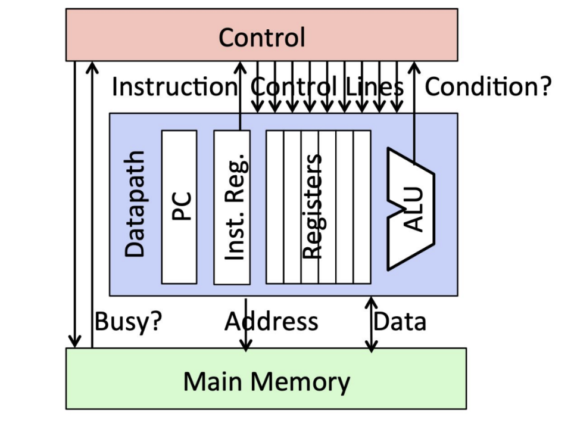

# Microarchitecture
## Machine Code
- Machine code is generated by an assembler using tables, and the format of this machine code depends on the type of instruction
- 
  - The **opcode** is a 7-bit string that specifies the operation to be performed 
    - Some instructions have the same opcode but differing `funct3` specifications - similar instructions (such as comparisons or logical operations) share the same opcode but are differentiated from each other using the `funct3` fields
      - `funct7` is similar to `funct3`, but it has more bits - `funct7` is not typically that important
  - Since there are 32 registers, *each* register fields only need 5 bits
    - Some instructions require multiple registers
  - The size of the immediates vary depending on the type of instruction - some instructions (i.e. J-type) have more bits for immediates than others
    - The design philosophy is generally to fill whatever remaining space there is with immediates
  - 
## Microarchitecture
- The hardware implementation of the ISA (the aforementioned instructions) is known as the **microarchitecture**
  - The goal is to have a *fast* implementation
- Architecture is designed with **state-machine view** in mind
  - 
- Lifecycle of an instruction (under a state machine):
  - Instruction is fetched from memory
  - Operands should be loaded - read registers and memory if applicable
  - Operation should be actually executed
  - Result should be stored - whether it be in a register or memory
  - PC should be updated
  - Repeat from beginning

## Memory Design Detour
- Memory can be interpreted as an array of registers, with a width W (also known as a memory line) and a length L
  - Since memory should typically be byte-addressable, the width is typically 8 bits
- A line of memory is chosen based on its address and is selected via a **multiplexer (MUX)** - so, given an address, the multiplexer selects the appropriate memory line
- The cells of memory can use different types of technologies:
  - **Latches and Flip-Flops** (aka Registers) are extremely fast (with parallel access) but are very expensive (one bit ~ tens of transistors)
  - **Static RAM** (SRAM) are relatively fast, but can only read/write one data word at a time and are expensive (one bit ~ 6+ transistors)
  - **Dynamic RAM** (DRAM) is relatively slower, able to read/write one data word at a time (and reading destroys the content, which requires the need for a refresh) - however it is cheap (one bit ~ one transistor plus a capacitor)
  - **DISK** (flash memory, hard disk) is much slower and is very cheap
- A combination of memory technologies (**memory hierarchy**) - 