# Microarchitecture Design
- 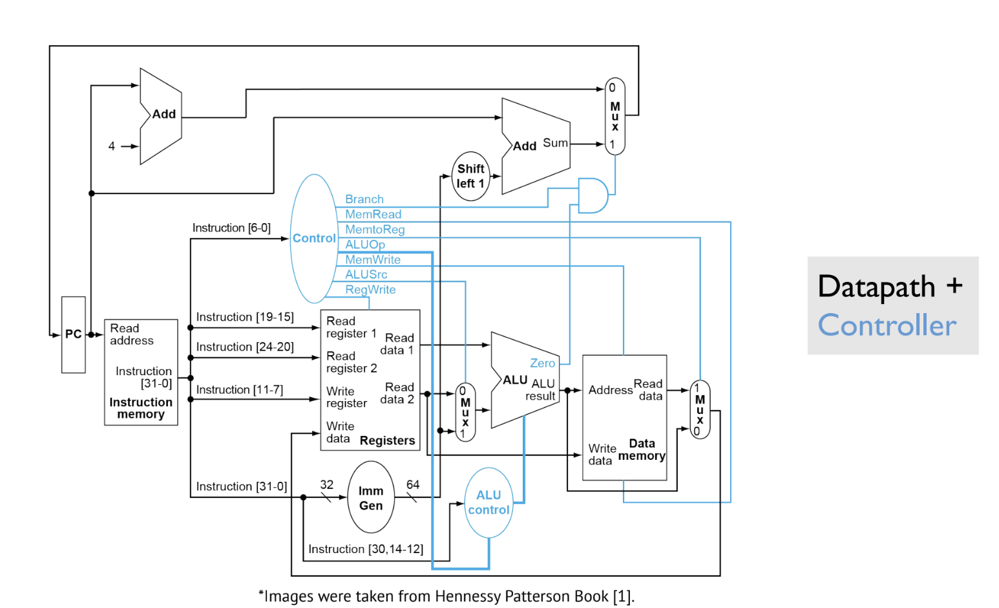
## Instruction Fetch - Instruction Memory
- 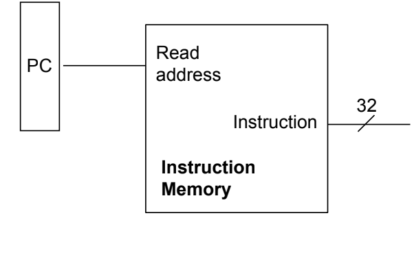
  - The instruction address is read from the program counter (PC), the memory is then read at that address, and a 32-bit instruction is outputted and directed 
  - All 32 bits of the program counter (PC) may not be needed during the fetch process
    - This is because the instruction memory may not span $2^{32}$ bytes, so instructions do not require all of the bits (they are usually zero)  
  - Memory is addressable, so the next instruction is situated at PC + 4 (4 bytes is 32 bits)
## Loading Operands - Register File
- During the actual process of reading an instruction (which is in machine code), immediates are already embedded in the instruction itself, so there is no need to externally fetch them - registers, however must be loaded via **register files**
- 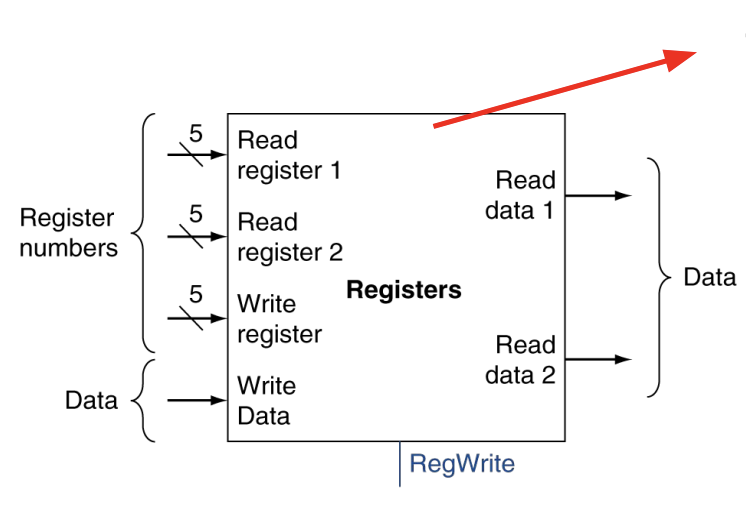
  - The 5-bit register specifier in a machine code instruction is used to denote the proper register
  - The operands of instructions of the form `OPERATION rd, rs1, rs2` correspond to inputs `Write register`, `Read register 1`, `Read register 2`
  - The `Write Data` input is the actual data (32 bits) provided to update `Write register` (`rd`)
  - `Read data 1` and `Read data 2` correspond to the actual *values* (32 bits) of `rs1` and `rs2`, which are then fed to other units that need to operate on those registers
## Instruction Memory and Register File
- 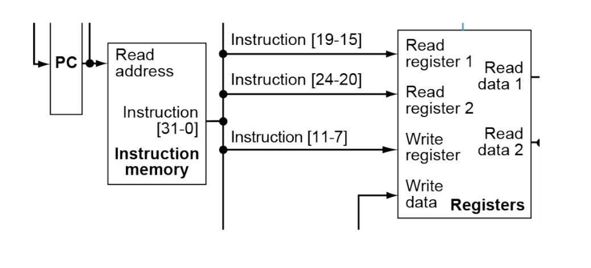
  - After the instruction is read from memory and outputted, the bits in the instruction corresponding to `rd`, `rs1`, and `rs2` are wired to the proper inputs in the register file
    - The structure of machine code instructions ensures that, if an instruction uses `rd`, `rs1`, and/or `rs2`, then those register numbers will always correspond to the specified bits
## Loading Operands - Memory
- 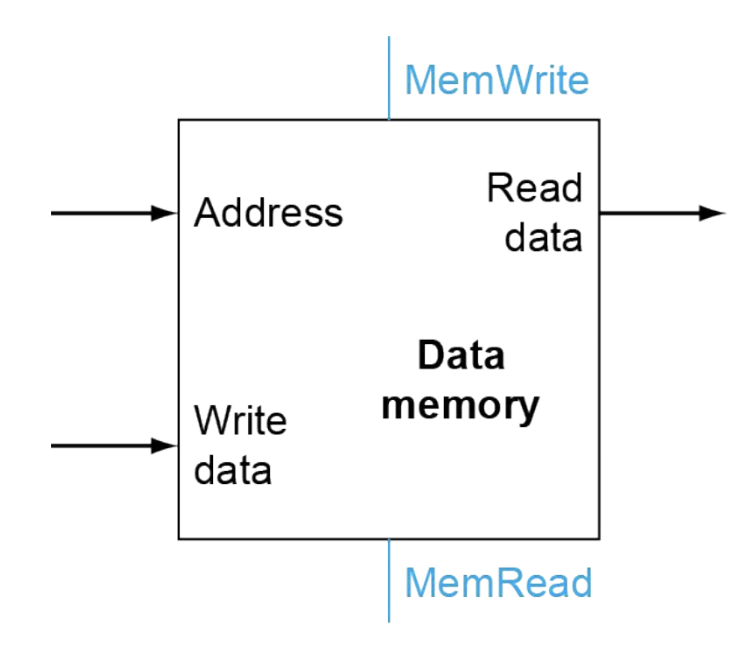
  - Although in this representation `Data Memory` is specified, in reality both instructions and program data are present in the *same* memory unit
  - If data is read from memory, it is outputted to `Read data` (typically in 32-bits, though if `LH` or `LB` is used then only certain bits of memory are outputted and the rest is padded or sign extended)
  - If data is being stored to memory, then that data being stored is outputted to `Write data`
## Controllers
- A CPU microarchitecture consists of both a **datapath** and a **controller**
  - A **datapath** is a collection of functional units that process data and create data-flow (i.e. a register file)
  - A **controller** is a unit that directs the operations on the datapath
      - A controller is necessary to determine what operands to load based on the instruction type - **decoding**
      - After the current instruction is read, it is fed into the controller so that it can output control signals in *parallel* to the rest of the activities performed by the datapath
  - 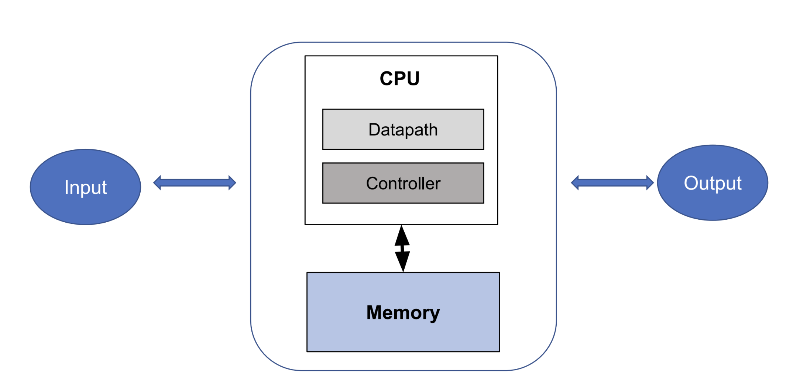
### Building a Controller
- Controllers are built using **Finite-State Machines**
  - A finite-state machine is a mathematical model of computation, where at each point the system can only have one of several finite states
  - This machine shows all states and how they transit to each other
    - Think of a state diagram for sequential logic circuits
  - A controller is effectively a giant finite-state machine with many states
    - A **single-cycle design** of a controller returns to the *initial state* after performing all of its processing, repeating its process again for the next state
  - 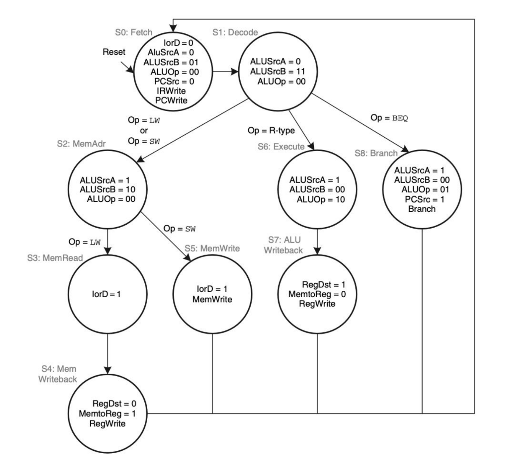
- The controller works in parallel with the datapath
## Building a Simple CPU
- Consider a simple CPU with a handful of instructions: `add`, `sub`, `and`, `or`. `lw`, `sw`, `beq`, `addi`, `andi`, `ori`
  - These instructions can be uniquely identified via its opcode, funct3, and funct7 identifiers in the machine code
- 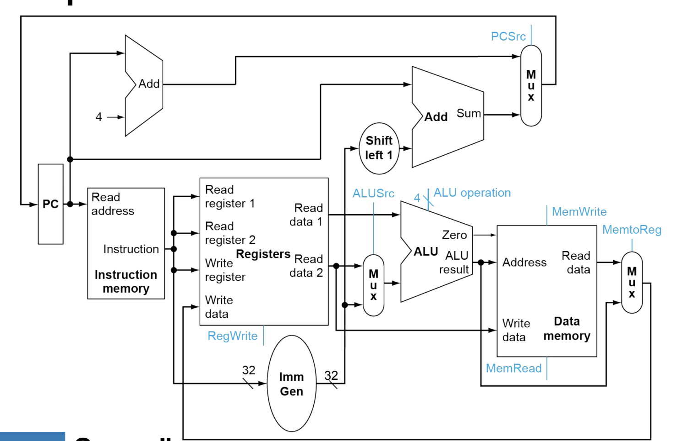
### Datapath: nextPC
- 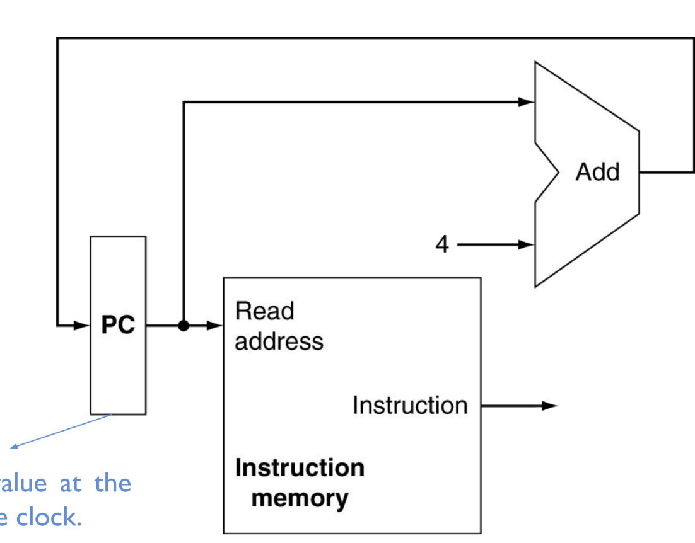
  - Registers are edge-triggered, so at the next positive edge of the clock, the PC gets its new value
    - There is still potentially a propagation delay from the PC to the adder as well as the length of the adder back to the PC, and this delay is proportional to the length of the wire from the PC to adder
      - $t_{pc} = t_{wire} + t_{adder} + t_{wire}$
      - Physically keeping these components as close as possible is very important
  - This does not account for branching *yet*
### Datapath: ALU
- The **ALU** performs arithmetic operations on two operands (register-register or register-immediate)
- 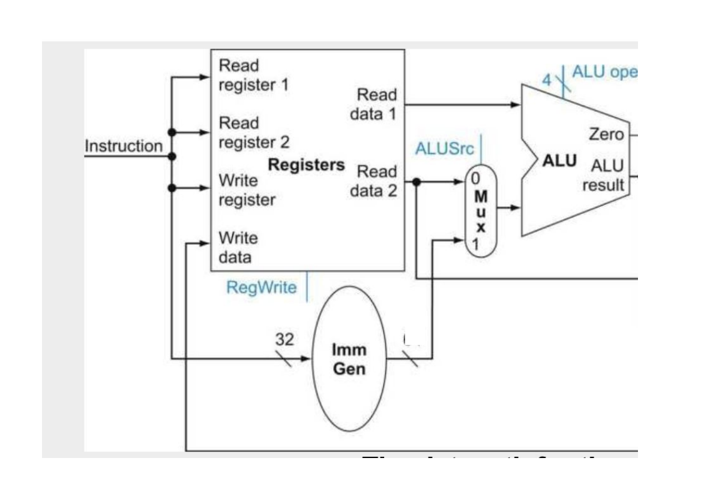
  - The 4-bit `ALU ope` control signal is used to identify which specific ALU operation is to be performed (i.e. addition vs. and vs. or vs. etc.)
  - Since immediates are stored in the instruction itself, all 32-bits of the instruction are loaded into an Immediate Generator and the proper immediate is parsed
    - The sixth bit of the opcode is 0 for data transfer instructions and 1 for conditional branches
    - The fifth bit of the opcode is 0 for load instructions and 1 for store instructions
    - These bits can be used to control a multiplexor that selects the appropriate immediate to load
      - Both the 12-bit and 20-bit immediate is calculated, but the multiplexor only chooses one of the two to output
        - This calculation process involves parsing the immediate into proper form (since in the machine code structure the bits of the immediate may be rearranged and split)
      - Both types are calculated because the controller signal indicating the type of operation may not be immediately available 
        - It is more time-efficient to calculate both and then wait for the signal to determine which one to select instead of first waiting and then calculating the immediate
    - The `MUX` connected to the ALU determines whether the operation is register-register or immediate-register, and this is determined by the `ALUSrc` controller signal
- The ALU has its own controller to determine which operation to perform
  - 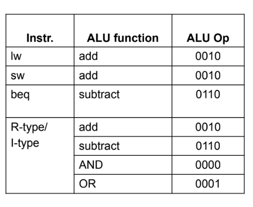
  - The main controller makes decoding the ALU operation associated with an instruction much simpler by sending two bits the ALU controller
    - For any non-R-type or non-I-type instructions that use addition (`lw`, `sw`), the `ALUOp` signal will send `00` to the ALU controller, which it will immediately understand indicates that there is addition and will therefore generate the addition ALU control input
    - For `beq`, the `ALUOp` signal will send `01` to the ALU controller, which it will immediately understand indicates that there is subtraction and will therefore generate the subtraction ALU control input
    - For R-type and I-type instructions, the `ALUOp` signal will send `10` and `11` respectively, which will indicate to the ALU controller that it should check the `funct3` and `funct7` fields to determine which specific operation to perform and generate the appropriate ALU control input
    - This approach is faster since it allows for frequent operations (addition and subtraction) to be decoded quickly without the need to lookup and parse `funct3` and `funct7`
## Datapath: Memory
- 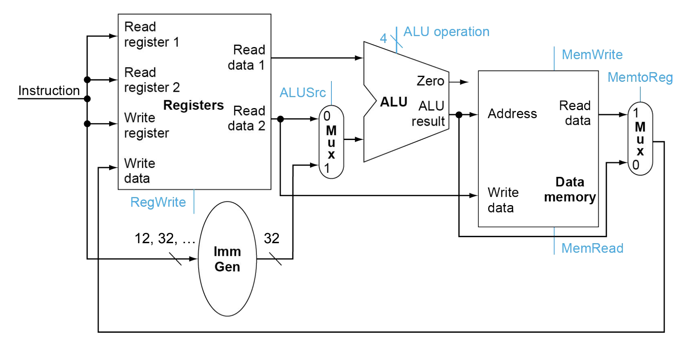
  - The ALU is used to perform the addition when calculating memory offsets since it already has access to the register data
  - For a load word operation, the `MemRead` controller signal is set and the calculated address (`rs1` + `immediate`) is read from memory and then outputted to the `MUX` which  (if `MemtoReg` is set, which it is supposed to be in this case) will write this data to the appropriate `rd` register
    - `RegWrite` will be set in this case because the write register is being modified
  - For a store word operation, the `MemStore` controller signal is set and the memory at the calculated address (`rs1` + `immediate`) stores the `rs2` data, which is directly wired to `Write Data`
    - In this case, `MemtoReg` is not set because a store operation does not store any results in a register - this also means `RegWrite` must not be set either
  - In the case of a non-memory operation, the memory unit can be bypassed via the `MUX` controlled by the `MemtoReg` controller signal - when this signal is set to zero, the result of the ALU is directly written to a register 
    - `RegWrite` will be set in this case because the write register is being modified
## Datapath: Branch
- 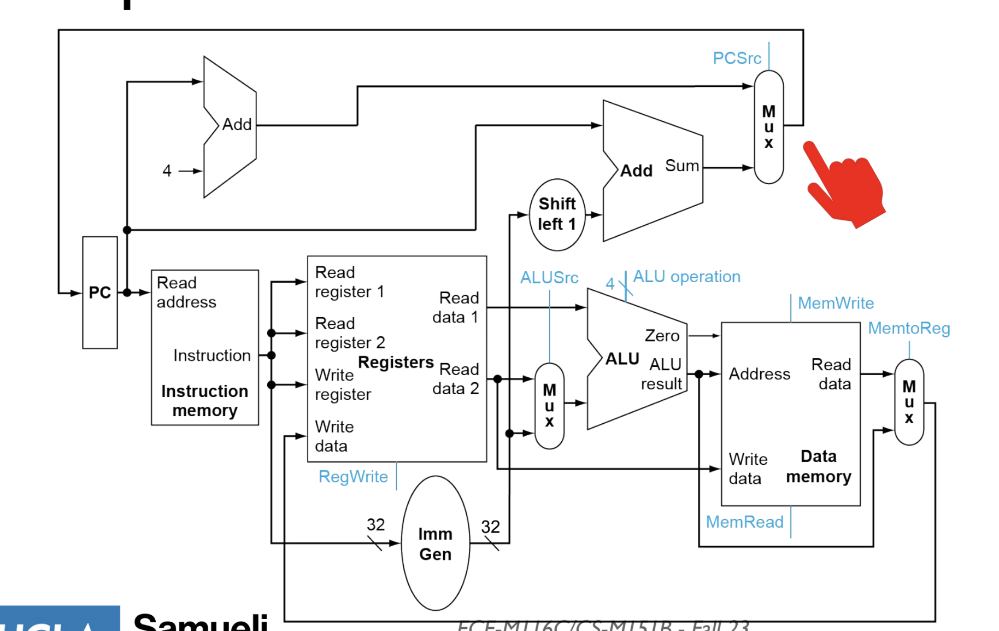
  - To also account for branch logic, the ALU has a `Zero` flag bit, which is set whenever `rs1 - rs2 == 0`
  - If this flag is true, then `BEQ` can be performed and the offset immediate can be sent to the branch adder (shifted left by 1 since addresses must be even) and then added with the current program counter
  - A controller signal `PCSrc` then determines whether the operation is a branch operation and, if so, set the new program counter to `pc + immediate` (instead of `pc + 4`)
    - In practice, `PCSrc` is determined by the logical AND of the `Zero` flag and `Branch` flag of the controller
## Designing a Finite State Machine
- When creating a finite state machine, everything should *first* be assigned to zero (active low) and then, based on the instruction (opcode) and current state, some control signals should be changed
- Figuring out the current instruction is done based on the `opcode`, which acts similarly to a large switch case
  - Some instructions may have multiple candidates, so `funct3` and `funct7` is used to further decode the instruction - an example of this is the `ALU`
  - 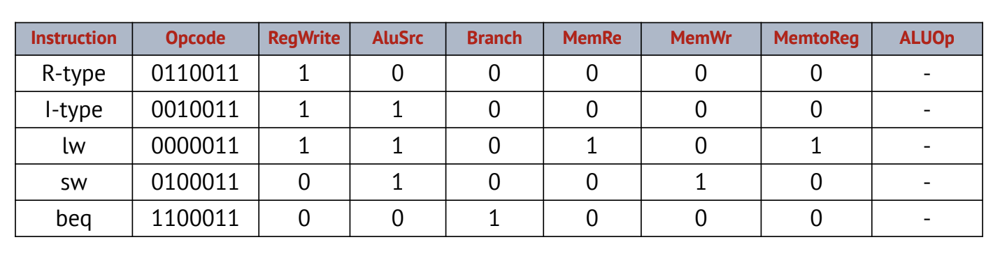
## Delay and Timing Concerns
- Logic performed by the datapath and controller is done in *parallel* and *synchronously*, which is why understanding the timing for each component (each unit, controller, and memory) is important for determining how long it would take for an operation to successfully execute
  - Having a clock cycle be *faster* than this time would result in correction issues
  - This implies that the clock cycle must be slow enough to account for the slowest **critical path**, which is often the load word instruction