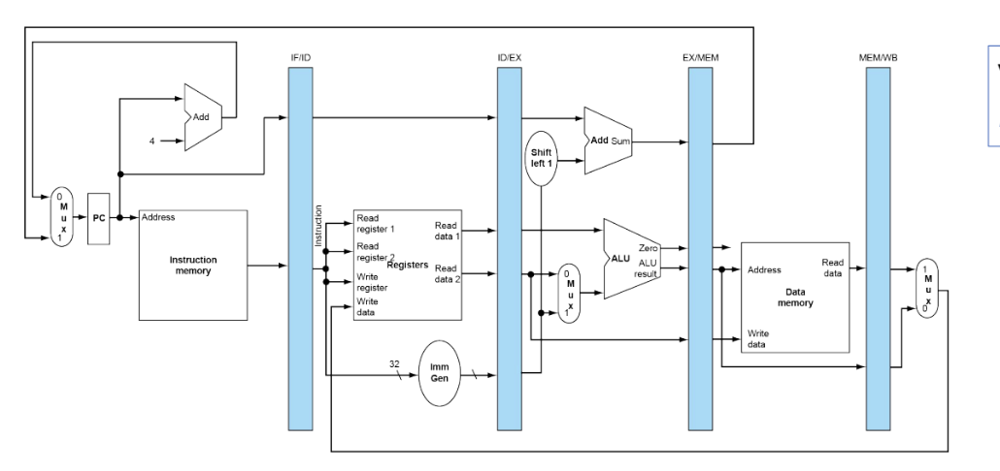
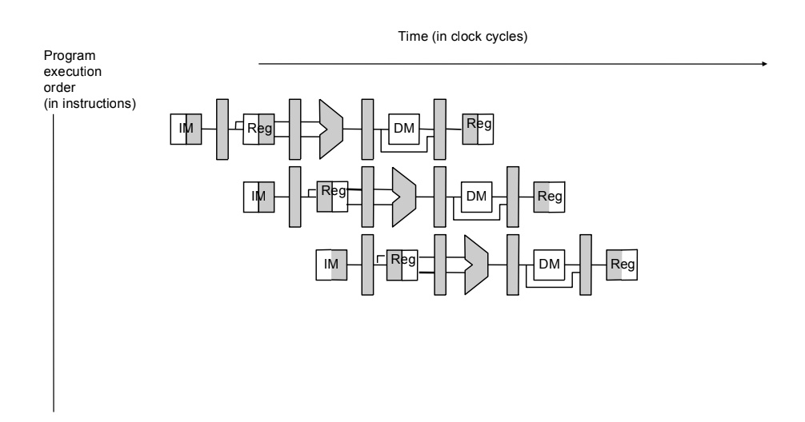
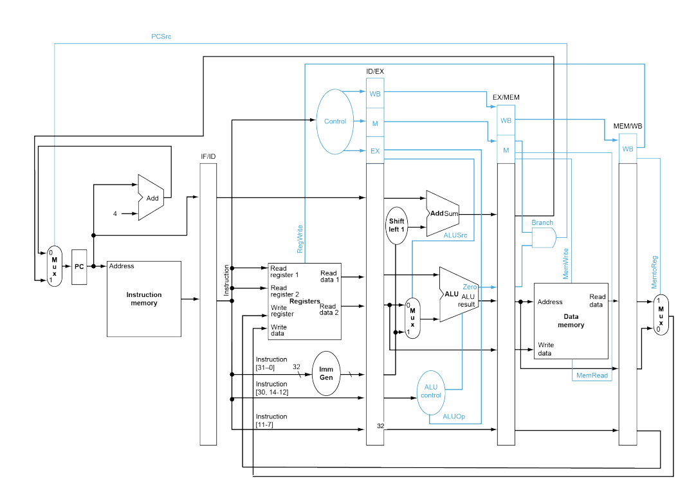
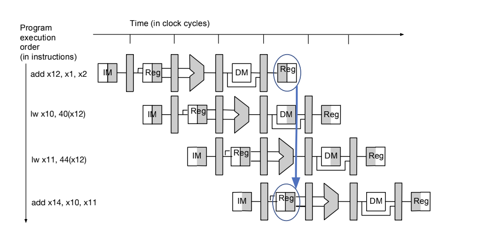

# Performance and Pipelining
- The aforementioned single-cycle design is simple and easy to design but not necessarily the most efficient
  - This is because different instructions have different paths and hence different delays - the *longest path* is the **critical path** and determines the clock period
- The critical path is typically the **load instruction** because it must be from *instruction memory* to the *register file* to the *ALU* to the *data memory* and finally to the *register file*
## Performance and Metrics
- **Latency** refers to how long it takes to finish a task (measured in seconds)
  - Lower latency is better
- **Throughput** refers to how many tasks can be done for a given time (measured in instructions per cycle or bit per second)
  - Higher throughput is better
  - For single-cycle design, the throughput is only 1 instruction per cycle
- Throughput is not necessarily interchangable with latency (that is, $throughput \neq 1/latency$)
  - In instances where there is concurrency, they are not the same as different tasks can overlap 
    - For multiple, concurrent tasks, the throughput is the number of tasks divided by the time at which the final task completed whereas the latency is the sum of the time it takes for *each* task to finish (and not necessarily how long it took for the last task)
### Other Metrics
- **Power** is another metric (measured in joules per second)
  - Lower power is better
- **Energy** is the product of power and latency
### Time
- **Time** is the measure of computer performance, and so the computer that performs the *same amount of work* in the *least time* is the fastest
  - If the time it takes for a set of tasks for one computer is less than the time it takes for a set of tasks for another computer, then the first computer is faster
- Measuring this time is not necessarily straightforward, as there may be delay by the operating system in loading the program, context switches between different programs, delays in waiting for I/O, etc.
  - The time that is measured is the **CPU time**, which is the amount of time actually spend computing the program (and not waiting for I/O, for instance)
- Measuring CPU time is not easy because it is not readily accessible - all that can be measured is elapsed time (which is not the same as CPU time for the aforementioned reasons)
  - CPU time is typically measured via simulation - a piece of software is used that accurately mimics the behavior of a real processor
  - Simulations allow for architecture design to be tested without building the actual hardware (which is costly for development purposes), but there is nonetheless a potential trade-off between simulation accuracy and complexity
- When measuring CPU time, the type of application that is used during the measurement is important
  - **Benchmark software** is typically used, which is a set of programs that were carefully designed to measure a specific metric 
    - These programs are typically very diverse to account for as many use cases of a computer as possible
### Iron Law
- The **Iron Law** of processor performance indicates that:
  - *CPU Time = Instruction Count * Cycle per Instruction * Cycle Time*
    - Improving CPU performance involves improving any of these categories
- **Instruction Count (IC)** refers to the number of instructions that are being executed
  - This can be reduced by changing the algorithm of the program
  - This can also be reduced by using a better compiler or instruction set architecture
- **Cycle per Instruction (CPI)** refers to the number of cycles needed to execute a given instruction
  - Different instructions (i.e. `MULT` vs. `ADD`) may have differing CPI
  - CPI can be optimized by leveraging various architectural techniques
- **Cycle Time (CT)** refers to the inverse of clock frequency
  - A faster clock rate decreases cycle time, but this requires device and architecture-level techniques to improve instructions so that they are fast enough to occur within a smaller cycle
## Pipelining
- 
- In a **pipelined** design, the datpath and controller is split into multiple (in this case five) stages
  - The next stage of the pipeline only needs to wait for the previous stage - instead of waiting for *all* of the stages 
- In a pipeline, intermediate values are stored in registers 
  - These registers are *not* the same as general-purpose registers
  - Referring to the diagram, these registers correspond to the intersection of the stages and the wiring (i.e. for the first stage, registers to store the current PC as well as the instruction; for the second stage, registers to store the PC value, `rs1`, `rs2`, and the generated immediate)
- This approach allows for effectively a five times faster clock speed, since the clock cycle now only depends on the slowest stage
  - As it is now, though, the instructions per cycle is actually decreased to now being 1/5th of an instruction per cycle (this can soon be improved back to 1 instruction per cycle by introducing concurrency in instructions)
- There are five stages - *Instruction Fetch*, *Register Fetch*, *ALU Executon*, *Memory*, and *Writeback*
  - This division of stages is the most balanced
- The main advantage of a pipelined design is the ability to *parallelize resources* - specifically, this is instruction-level parallelism (compared to thread-level parallelism)
  - 
  - This approach roughly allows for one instruction executed per cycle, but reduces the cycle time by a factor of five (5 stages) - this results in an overall efficiency increase by a factor of five
- The control signals in a pipeline are also saved in registers, since cycles depend on control signals (and these signals will change per stage)
  - 
- The notion of a **half cycle** is relevant to registers
  - For the writeback stage, the register is written to during the *first half*
    - This write is done when the clock is *active*
  - For the register file stage, the register is read from during the *second half*
    - This read is done when the clock is *not active*
  - 
    - In the case where a register is being updated during the writeback of one instruction and simultaneously being read during the register file phase of another instruction, half cycle ensures correctness