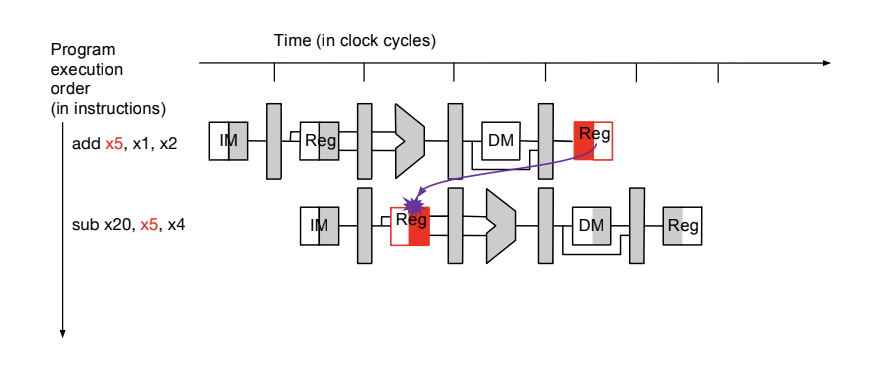
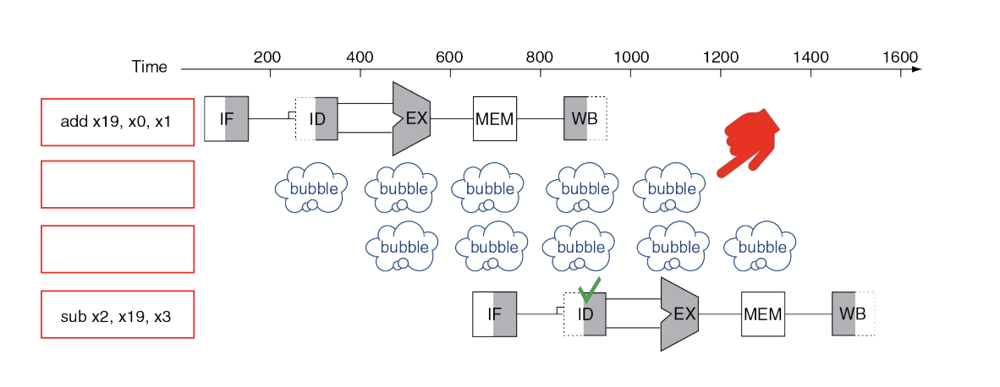
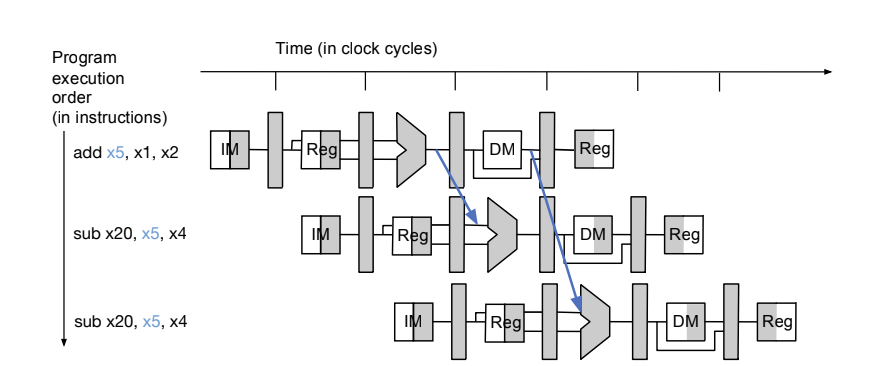
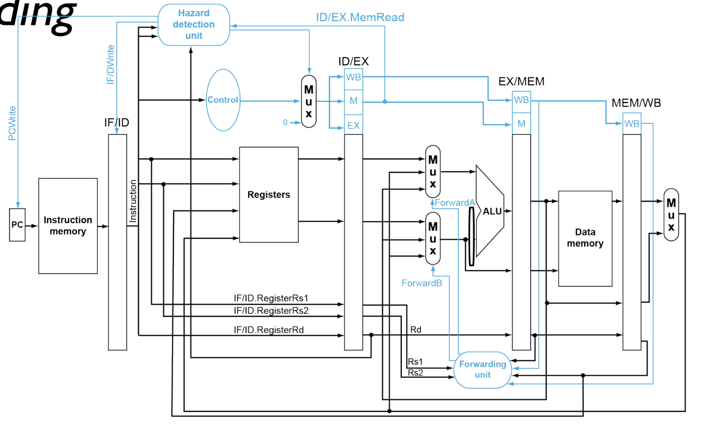

# Pipeline Design and Hazards
- Consider the following sequence of instructions under a pipelined design:
  - `add x5, x1, 2`
    `sub x20, x5, x4`
  - 
    - The correct value of `x5` is not used in the second instruction because the `add` instruction has not yet performed a writeback
- A **hazard** is a situation in pipelining when the next instruction cannot execute in the following clock cycle, usually due to interdependencies in instructions
- A **data hazard** occurs when the operands are not yet available for an instruction (due to dependency to previous instructions on the pipeline)
  - A **read-after-write (RAW)** data hazard involves writing to a register `rd` and using it (as `rs1` or `rs2`) *before* the writing is finished (before `rd` reaches the writeback stage for the initial instruction)
    - A RAW hazard can occur for two cycles, as the separation between the register read stage and the writeback stage is two stages (due to half cycles, the register read and register write can occur at the same time)
  - A **write-after-write (WAW)** is an output dependency, but this is not relevant to the (current) pipelined processor because instructions are executed in order (even though instructions are overlapping, they are still being executed in order) - that is, the writings occur in order
    - `ADD x5, x1, x2`
      `SUB x5, x4, x6`
  - A **write-after-read (WAR)** is a false dependency, but this is also not relevant because instructions are executed in order
    - `ADD x20, x5, x1`
      `SUB x5, x2, x3`
- To deal with read-after-writes, one approach can be to stop the processor until the first instruction reaches the writeback stage - a *stall*
  - This stalling occurs by introducing *bubbles*, or *null operations (NOPs)*, which are instructions that do nothing but are pushed through the pipeline (because this pipeline still requires instructions to still be fed through at all times, but for a stall there cannot be any "real" instructions )
  - This stalling is done until the correctness can be ensured (so enough NOPs until the first instruction reaches writeback stage, and the second instruction reaches the read stage)
    - The writeback and register read instructions are essentially "aligned"
  - Stalling is done at the *decode stage* - it is in this stage that the registers for the instruction are known, so it can be determined if there is a hazard and the bubbles can be placed appropriately
    - When a stall occurs, the stage that is being stalled (e.g. decode) is essentially "stuck" in the pipeline, so another instruction cannot move on to the same stage until after the stall moves forward
  - This approach obviously incurs a performance penalty on the occurence of a hazard
  - 
- Another approach is to utilize **forwarding (bypassing)**, where, if a result is already computed (i.e. via the `ALU` ), then it can be directly passed to the dependent instruction in the other cycles
  - This requires that the output actually be readily available during the execution stage (which means that bypassing does not necessarily work for `lw` instructions)
  - This prevents the need to wait for the writeback stage
  - 
    - A read-after-write hazard can be available for two cycles, so it is necessary for two forwards
      - A forward from the `ALU` output, which is available at the beginning of the `Memory` stage, to the input of the `ALU` for the next cycle 
      - A forward from `Memory` output, which is available at the beginning of the `Writeback` stage, to the input of the `ALU` for the next next cycle
- This type of forwarding works for operations where the result is immediately available from the `ALU` (so I-Type or R-Type instructions), but `lw` is different because the data is only available at the end of the `Memory` stage (specifically, the second half of the cycle)
  - This means that, for `lw`, forwarding can only occur from the `Memory/Writeback` stage, therefore requiring a stall on a detected hazard
    - The stall, however, needs to only occur for *one cycle*
## Detecting when to Forward or Stall
- A **hazard detection unit** is in charge of checking for any potential hazards; in the case of RAW data hazards, it checks when:
  - The `rd` register of the `Execution` / `Memory` stage is equal to the `rs1` or `rs2` of another instruction's `Load` / `Execution` stage and `RegWrite` is set, then it will forward from the output of the `ALU` (the first forward)
  - The `rd` register of `Memory` / `Writeback` stage is equal to the `rs1` or `rs2` of another instruction's `Load` or `Execution` stage and `RegWrite` is set, then it will forward from the output of the `Memory` (the second forward)
  - This unit will *not* forward if the register in question is `x0` because it is always hardwired to zero
  - If there is a hazard for the *same* register for the two prior instructions, then the most recent instruction will have the most recent updated value, so it should the forwarding should prioritize the most recent value of the register
    - e.g.
    -     addi x2, x3, 1
          subi x2, x2, 5
          andi x2, x2, 6
      - For the `andi` instruction, there could be two forwards - `x2` from the `addi` and `x2` from the `subi` - but the correct forward is from the most recent instruction, `subi`
    - In other words, the `Execution / Memory` forwarding should always be done in the case of a tie
- In the case of a load-use hazard, it will determine that it is necessary to stall when:
  - The `rd` register of the `Load` / `Execution` stage is equal to the `rs1` or `rs2` for another stage's `Instruction Fetch` / `Instruction Data` and `MemRead` is equal to 1 for the `ID/EX` step
- 
  - For the **forwarding unit**, the `rd` register is passed through each stage of the datapath, and is checked with the `rs1` and `rs2` during either the `EX/MEM` stage (first type of forward) or during the `MEM/WB` stage (second type of forward)
    - The ALU output from the beginning of the `EX/MEM` stage and the end of the `MEM/WB` stage are both passed back into both inputs of the `ALU`, and the control unit determines whether forwarding is necessary and, if so, which inputs require forwarding (it could the case that both require forwarding)
  - For the **hazard detection unit**, the `MemRead` signal and `rd` of a `ID/EX` stage is compared with the `rs1` and `rs2` of the previous `IF/ID` stage to determine if a stall is necessary
    - During a stall, the current `ID/EX`, `EX/MEM` and `MEM/WB` continue on to the next stage as normal, but everything before must wait
    - These previous stages are stalled by sending a signal to the registers of the previous `PC` and `IF/ID` stages to *not* write
    - A `MUX` is also used to replace control signals to the next phase (which will have a `NOOP`) so that the bubble does not update any state as it propagates (it does not update any registers, memory, etc.)
    - If so, a `NOOP` is inserted by replacing all control signals to be `0` via a `MUX` unit (near the top) so that any state (registers, memory, etc.) is not updated during the stall and to send signals to previous stages to *not* update registers (think of it as a write-enable)
