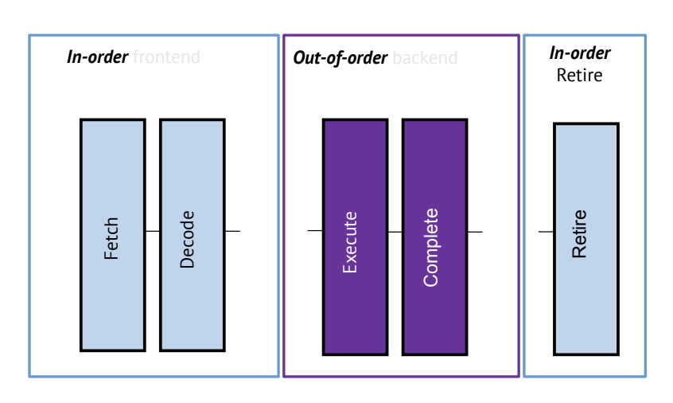
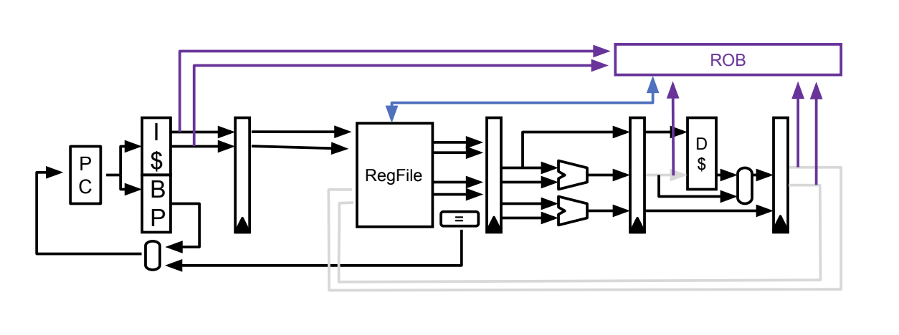

# Superscalar and Out of Order Execution
- Attempting to improve processor performance by adding *more pipeline stages* ultimately leads to **diminishing returns**
  - More stages brings about more hazards and therefore more complexity in order to deal with these hazards
  - The delay from reading from and writing to pipeline registers will only increase as more stages (and therefore more registers) are added
- **Scalar pipelines** only process *one instruction* at a time per stage - they are fundamentally limited to an IPC (or CPI) of 1, though the true amount may be less due to hazards and stalls
- Thus, another approach to improving performance is to go beyond *scalar pipelines* and process *multiple instructions at a time* (e.g. two or four at a time) - this is known as **superscalar** processing or **instruction-level parallelism**
  - Ideally, this could increase IPC to *N* for an N-issue superscalar processor
- 
  - The goal is to try to effectively *double* (or quadruple if processing four instructions at a time) the units at each stage, but *not everything* can necessarily be doubled
  - Memory, for instance cannot be doubled since memory represents *state* and it would therefore not make sense to have two separate memories
    - Additionally, only one memory load or store can be issued at a time, so the number of ports to the memory unit cannot be increased
  - It would not make sense to have a new register file - rather, it is better to just double the ports (input and output) for the register file, though this is expensive (in terms of power and area)
  - The program counter does not need to be replicated - both instructions can be fetched at the same time (Current: `PC` and Next: `PC + 4`)
  - The ALU unit is doubled, but due to the aforementioned limitations with memory, one ALU is typically used for `lw`, `sw`, or `beq` instructions whereas the other one is used for arithmetic operations
    - If there are two `r-type` instructions, then both can be used
  - An ideal scenario for superscalar involves instructions that can leverage everything fully *without any dependencies*
    - e.g. `lw x1, 40(x0)` and `add x4, x3, x2`
    - e.g. `sub x7, x6, x2` and `addi x2, x3, 10`
    - e.g. `sw x6, 40(x0)` and `addi x2, x5, 20`
- Superscalar presents significant issues when dealing with *dependencies*
  - Attempting to forward for RAW hazards, for example, becomes much more complex and expensive
    - e.g. For a N=2 superscalar processor, now there are *double* the amount of forwards (which also requires more complex checking for forwarding)
      - For even higher N, this becomes even more difficult because checking for RAW hazards would require checking *all* pairs of `rd` and `rs` registers, and processing more instructions at a time also increases the probability of there being a dependency
- Superscalar with **in-order fetching** prevents the processor from reaching its full potential, but this issue can be solved by leveraging **out-of-order execution**
  - The biggest bottleneck in in-order superscalar processing is the presence of *dependent* instructions
  - What can instead be done is find *independent instructions* and feed those instructions into the pipeline
    - The instruction "window" is checked to find the first available instruction that is independent from the instructions considered so far, and then add that instruction into the pipeline
    - This allows for the pipeline to almost always fully be utilized, so $IPC \approx N$
- Out-of-order execution presents a wide variety of issues
  - It requires a mechanism for *tracking instructions*
  - It requires a mechanism for *removing data hazards*
  - It requires a mechanism for *recovery*
- The main approach for ensuring recovery with out-of-order execution is to *complete* instructions out-of-order but *retire* (or *commit*) them in-order
  - 
  - When the actual execution of an instruction is done, it is put into a *completed* buffer and any **architectural state** (memory or registers or PC) is not yet updated
    - If there is a mispredicted branch, then a *pipeline recovery* is performed by flushing all instructions in the pipleine and removing all dependent instructions in the completed buffer
    - Data is written to architectural state in order, where it becomes *retired*
      - For instance, if `I1`, `I2`, and `I7` are in the completion buffer, then `I1` and `I2` can be retired, but `I7` cannot be retired until `I3` - `I6` are retired (that is, they are in the complete stage)
  - The data structure used to implement this is known as the **re-order buffer (ROB)** which is a circular table that holds all completed instructions
    - It will only retire an instruction $I_x$ only if *all*  $I_j, j < x$ are also retired
    - There is a pointer `Head` that represents the instruction after the last retired instruction
      - If the instruction at the `Head` is completed, it is retired and the pointer moves forward by one instruction
      - Otherwise, if the instructon at `Head` is not completed, the pointer will stay in its place until the instruction is completed
      - If there is an *N*-issue processor, then at most *N* instructions can be retired at a time
    - Flushing is done with this ROB by clearing out all instructions in the buffer *after* the branch instruction
- 
  - The register files and memory is no longer updated by the pipeline but rather by the *ROB*